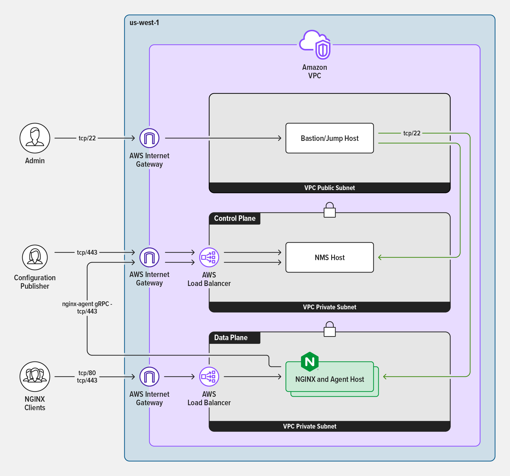

# NGINX Instance Manager Infrastructure

This repo contains instructions that can be used to generate images using the [NGINX Instance Manager Ansible role](https://github.com/nginxinc/ansible-role-nginx-management-suite) and [NGINX Ansible role](https://github.com/nginxinc/ansible-role-nginx). It also provides example infrastructure to deploy those images with Terraform using best practice security configuration.

- [Image generation using packer](packer/README.md)
- [Infrastructure Deployments using terraform](terraform/README.md)

Below is an example reference architecture that our example IAC can be used to create.

## Contributing

Please see the [contributing guide](https://github.com/nginxinc/nms-iac/blob/main/CONTRIBUTING.md) for guidelines on how to best contribute to this project.

## License

[Apache License, Version 2.0](https://github.com/nginxinc/nms-iac/blob/main/LICENSE)

&copy; [F5, Inc.](https://www.f5.com/) 2023
